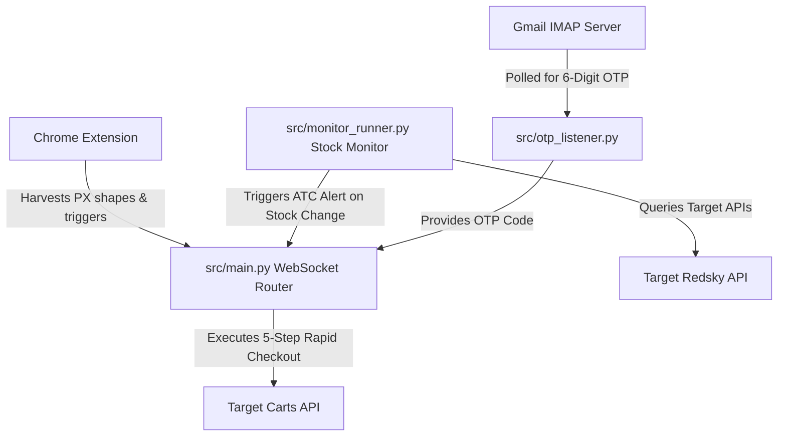

# Target Headless Automation & Stock Monitor

A high-performance, modular Python backend and stock monitoring service for Target, featuring automated headless OAuth checkouts, dynamic proxy routing, and IMAP automated OTP mail parsing.

---

## System Architecture

The project consists of three main components working together concurrently:
1. **Chrome Extension (Frontend Harvester):** Generates valid Akamai/PX anti-bot shape signatures and hands them off to the backend via a WebSocket interface.
2. **Stock Monitor (`src/monitor_runner.py`):** Periodically queries Target's Redsky product summaries through Oxylabs residential proxies to check item availability.
3. **Headless Checkout Engine (`src/main.py`):** Acts as the central WebSocket router. When a product is in stock, it dynamically updates request headers with fresh harvested signatures and carries out a rapid, 5-step API-based checkout sequence.



---

## Repository Directory Structure

```
target_bot/
│
├── data/
│   ├── item_urls.json           # List of target product TCINs to monitor
│   ├── stores.json              # Main Target store configurations (Brooklyn, etc.)
│   └── other_stores.json        # Alternative stores list for quick switching
│
├── src/
│   ├── __init__.py              # Python package initializer
│   ├── config.py                # Global state configs, locks, and environment mapping
│   ├── data_loader.py           # Self-healing file paths loader for items & stores
│   ├── otp_listener.py          # Gmail inbox monitor capturing security codes
│   ├── antibot.py               # AKAMAI/PX cookie shape update injector
│   ├── session_manager.py       # Session refreshing, Redirects & OAuth Token requests
│   ├── checkout.py              # Checkout step logic (Add-To-Cart, place order, delete)
│   ├── monitor_runner.py        # Spawns requests session to check item availability
│   └── main.py                  # Server entry point binding localhost:1909
│
├── .env.example                 # SAFE environment variables blueprint
├── .gitignore                   # Excludes secret credentials, logs, and sessions
├── requirements.txt             # Project Python package dependencies
└── README.md                    # This guide!
```

---

## Security Safety Built-In

This repository is pre-configured with secure Git boundaries to **never** leak credentials or active cookies.
The following files are completely isolated locally and will not be pushed to GitHub:
* `.env`: Holds your private accounts, password credentials, and proxies.
* `past_sessions.json` / `data/previous_session.json`: Contains live authentication session headers and browser cookies.
* `*log.json`: Huge monitoring transaction data files are ignored to keep the repository extremely light.

---

## Setup & Installation

### 1. Prerequisites
Ensure you have **Python 3.9+** (preferably Python 3.12) installed on your system.

### 2. Install Python Dependencies
Run the following command to download and install the required modules:
```bash
pip install -r requirements.txt
```

### 3. Configure Credentials
1. Copy `.env.example` and create a new file named `.env`:
   ```bash
   cp .env.example .env
   ```
2. Open `.env` and fill in your values:
   * **EMAIL:** Your Gmail address.
   * **EMAIL_APP_PASSWORD:** Your 16-character Gmail App Password (requires 2-Factor Authentication enabled in Google account settings).
   * **OXY_USER & OXY_PASS:** Your Oxylabs residential proxies login credentials.

---

## Execution Guide

To run the complete automated check-out cycle, follow these steps:

### Step 1: Start the Checkout Backend
This starts the WebSockets API listening on `ws://localhost:1909`.
```bash
python src/main.py
```

### Step 2: Connect the Chrome Extension
1. Open Google Chrome.
2. Navigate to your Refract Extension popup page.
3. Verify that the status indicator turns green: `✅ Chrome Extension connected!`.
4. Harvest at least 3 anti-bot shape signatures to trigger the automated background login flow.

### Step 3: Run the Stock Monitor
Open a new terminal window/tab and start the product monitor:
```bash
python src/monitor_runner.py
```

When an item specified in `data/item_urls.json` becomes available:
1. A sound alarm will trigger.
2. The monitor will immediately dispatch a WebSocket alert to `src/main.py`.
3. The backend will rapidly execute the checkout sequence.
